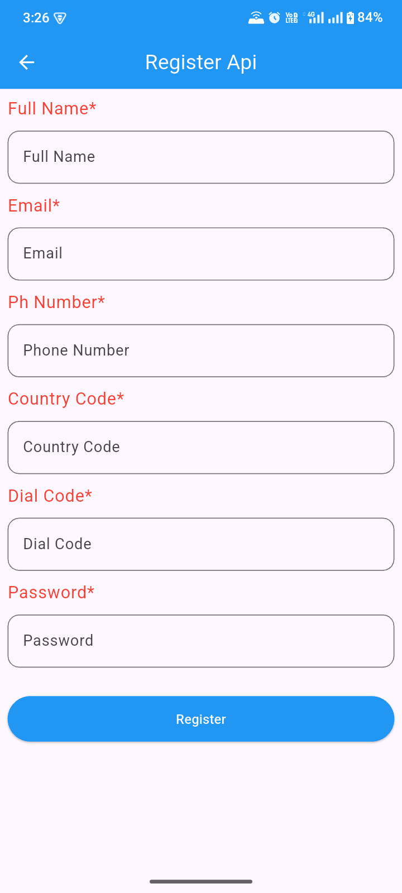
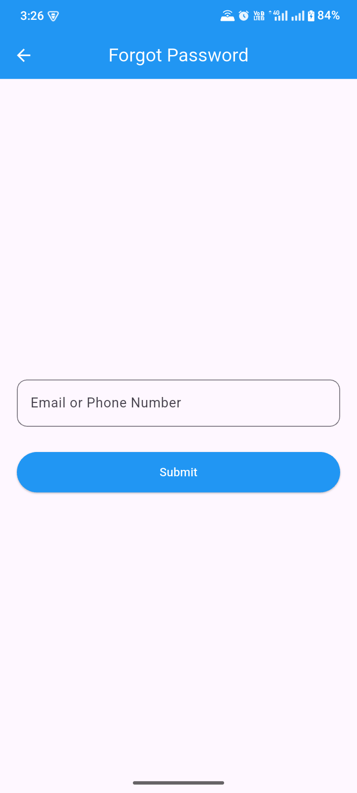
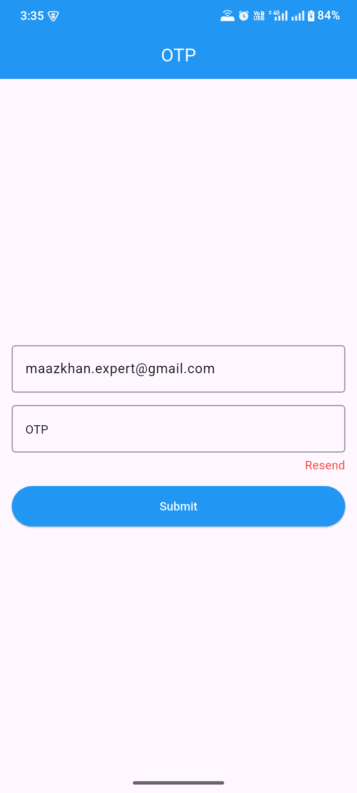
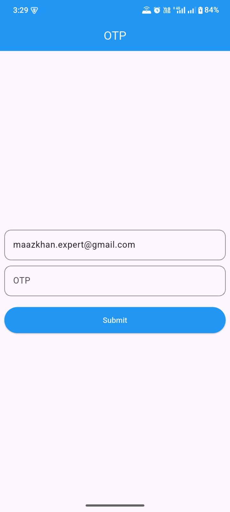
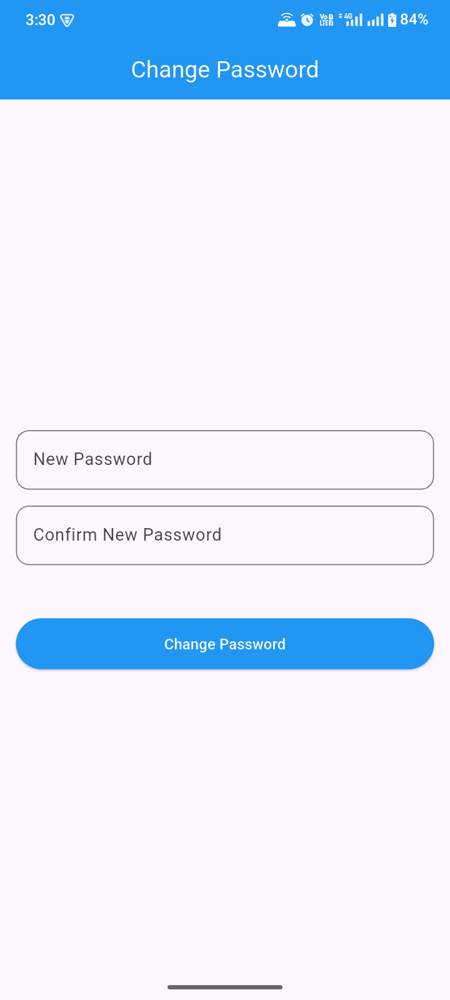

# Flutter Auth API Practice (HTTP)

A Flutter authentication practice app demonstrating a **complete auth flow** using the `http` package and a live REST API — no Riverpod or state management, just clean `StatefulWidget` + `setState` with a shared reusable `ApiService`. Covers Login, OTP Verification, Register, Forgot Password, OTP Reset, and Change Password — all connected to a real backend.

---

## Screenshots


## Authentication Screens
<p align="center">
  
  
  
</p>

## OTP & Password Management
<p align="center">
  
  
  
</p>


## Features

-  **Login** — Email/phone + password, on success navigates to OTP verification
-  **Login OTP Verification** — Verify OTP sent after login, with resend OTP support
-  **Register** — Full registration: name, email, mobile, country code, dial code, password
-  **Forgot Password** — Request OTP reset via email or phone number
-  **Forgot Password OTP** — Verify OTP and receive a `resetToken` from the API
-  **Change Password** — Submit new password + confirm password using the `resetToken`
-  **Loading button** — `CustomLoadingButton` disables and shows spinner during API calls
-  **Form validation** — All forms use `GlobalKey<FormState>` with field validators
-  **Shared `ApiService`** — Single reusable HTTP POST service with green/red SnackBar feedback

---

## Tech Stack

| Technology | Usage |
|---|---|
| Flutter | UI Framework |
| Dart | Programming Language |
| `http` `^1.4.0` | REST API calls (POST requests) |
| `StatefulWidget` + `setState` | Local UI state (loading flags) |
| `GlobalKey<FormState>` | Form validation |

---

## Project Structure

```
lib/
├── main.dart                              # App entry, starts at LoginPage
├── login_page.dart                        # Login screen → OTP page
├── login_otp_page.dart                    # Login OTP verify + resend OTP
├── register_api.dart                      # Registration form (6 fields)
├── forget_pass.dart                       # Forgot password — request OTP
├── forgot_pass_otp.dart                   # Forgot password — verify OTP → resetToken
├── forgot_pass_change.dart                # Change password using resetToken
└── common_widgets.dart/                   # ⚠️ Shared reusable components
    ├── api_service.dart                   # Centralized HTTP POST + SnackBar handler
    ├── my_url.dart                        # All API endpoint URL constants
    ├── my_button.dart                     # CustomLoadingButton (spinner while loading)
    ├── my_text.dart                       # LabelText (styled left-aligned label)
    └── my_textformfeild.dart              # CustomValidatedFormField (rounded border)
```

> **Note:** `common_widgets.dart/` is a folder named with a `.dart` extension — this is unusual naming. Consider renaming it to `common_widgets/` in a future refactor.

---

## API Reference

Base URL: `https://connect.masjiddev.softwareignite.com/api/`

| Screen | Method | Endpoint |
|---|---|---|
| Login | `POST` | `account/login` |
| Login OTP Verify | `POST` | `account/verify-otp` |
| Resend Login OTP | `POST` | `account/resend-login-otp` |
| Register | `POST` | `account/register` |
| Forgot Password Request | `POST` | `account/request-forgot-password` |
| Forgot Password OTP Verify | `POST` | `account/verify-forgot-password-otp` |
| Change Password | `POST` | `account/forgot-password-change` |

All requests use `Content-Type: application/json; charset=UTF-8`.

---

## Full Auth Flow

```
Login Screen
    │
    ├── [Forgot Password?]
    │         ↓
    │   Forgot Password Screen
    │         ↓ (OTP sent)
    │   Forgot Password OTP Screen
    │         ↓ (OTP verified → receives resetToken)
    │   Change Password Screen
    │         ↓ (password changed)
    │   ← Back to Login
    │
    ├── [Register]
    │         ↓
    │   Register Screen
    │         ↓ (success)
    │   ← Back to Login
    │
    └── [Login → success]
              ↓
        Login OTP Screen  ←── Resend OTP
              ↓ (OTP verified)
        ← Back to Login (pushAndRemoveUntil)
```

---

## Reusable Component Library

### `ApiService`
Centralized HTTP POST handler. Automatically shows a green SnackBar on success (2xx) and a red SnackBar on failure. Returns `http.Response?` — `null` on error.
```dart
final response = await _apiService.postRequest(
  context: context,
  url: Myurl.login,
  body: {"identifier": email, "password": password, "deviceId": "100"},
  successMessage: 'Login successful!',
  errorMessage: 'Email or password is incorrect',
);
if (response != null) { /* navigate */ }
```

### `Myurl`
All API endpoints in one place — update the `baseUrl` once to switch environments.
```dart
static String baseUrl = 'https://connect.masjiddev.softwareignite.com/api/';
static String login = '${baseUrl}account/login';
```

### `CustomLoadingButton`
Full-width button that disables itself and shows a `CircularProgressIndicator` while `isLoading` is true.
```dart
CustomLoadingButton(
  isLoading: _isLoading,
  onPressed: () async { /* API call */ },
  text: 'Login',
)
```

### `CustomValidatedFormField`
A `TextFormField` with rounded border, hint text, validator, `obscureText`, and `keyboardType` support.

### `LabelText`
A left-aligned styled `Text` widget for form field labels (e.g. "Full Name*").

---

## Getting Started

### Prerequisites

- Flutter SDK `>=3.8.1`
- Dart SDK `>=3.0.0`
- Android Studio / VS Code with Flutter extension
- Active internet connection (live API)

### Installation

1. **Clone the repository**
   ```bash
   git clone https://github.com/maazkhan-tech/flutter-auth-api-practice.git
   cd flutter-auth-api-practice
   ```

2. **Install dependencies**
   ```bash
   flutter pub get
   ```

3. **Run the app**
   ```bash
   flutter run
   ```

---

## Dependencies

```yaml
dependencies:
  http: ^1.4.0
  cupertino_icons: ^1.0.8
```

---

## What I Learned

- Making HTTP POST requests with the `http` package (`jsonEncode`, `Uri.parse`)
- Building a reusable `ApiService` that handles success/error responses and shows SnackBars
- Centralizing all API URLs in a single constants class (`Myurl`)
- `StatefulWidget` + `setState` for managing loading state without a state management library
- Form validation with `GlobalKey<FormState>` and per-field `validator` functions
- Passing data between screens (e.g. `identifier`, `resetToken`) via constructor parameters
- Multi-step navigation flows: `push`, `pushAndRemoveUntil`, and `pop`
- Building a `CustomLoadingButton` that disables during async operations

---

## Roadmap / Improvements

- [ ] Rename `common_widgets.dart/` folder to `common_widgets/`
- [ ] Add password confirmation match validator in Change Password screen
- [ ] Add null-safe guard before `jsonDecode` in `forgot_pass_otp.dart`
- [ ] Refactor to use Riverpod for cleaner state management
- [ ] Add token storage with `shared_preferences` after login

---

## Contributing

Contributions, issues, and feature requests are welcome!
Feel free to open an [issue](https://github.com/maazkhan-tech/flutter-auth-api-practice/issues).

---

## License

This project is open source and available under the [MIT License](LICENSE).

---

## Author

**Your Name**
- GitHub: [@maazkhan-tech](https://github.com/maazkhan-tech)
- LinkedIn: [View Profile](https://linkedin.com/in/your-linkedin)
